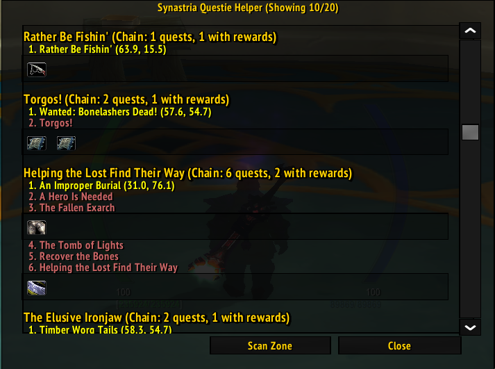

# Synastria Questie Helper

> **Locate all quests required for attuning in the current zone, including quest chains**

---

## Requirements

- **Questie Addon**: Required for quest database and coordinate lookups https://github.com/Netrinil/Questie-335
- **\[Optional\] TomTom Addon**: If TomTom is installed, it will add a waypoint when clicking the coordinates https://www.curseforge.com/wow/addons/tomtom/files/439781

---

## Features

- **TomTom**: Left click a coordinate to get a waypoint in TomTom (requires the TomTom addon).
- **Wowhead Link**: Right click a quest to get a popup with a link to the quest on wowhead.

---

## Quick Start

1. **Download & Extract**: Place the `SynastriaQuestieHelper` folder in your `Interface/AddOns/` directory.
2. **Enable**: Activate Synastria Questie Helper in your WoW AddOns menu.
3. **Click the Minimap Button**: Look for the yellow exclamation mark on your minimap.
4. **Scan Zone**: Click the "Scan Zone" button to find quests with attunement rewards.

---

## Commands

- `/synastriaquestiehelper toggle` — Toggle the quest list UI
- `/synastriaquestiehelper reset` — Reset UI position and size

---

## Screenshot

---

## Changelog

### Version 1.5

- Don't show header of completed quests
- Fixed dungeons not showing quests
- Show all relevant quests in a zone, even if the end reward is not in it

### Version 1.4

- Added auto launch option (Xayia)
- Added transparency options (Xayia)
- Added don't close on escape option (Xayia)

### Version 1.3

- Added configuration options accessible via right-click minimap button or addon settings
  - Hide Completed Quests (default: enabled)
  - Show Wrong Faction Quests (default: disabled)
  - Show Quests You Can't Accept (default: disabled)
  - Show Cross-Zone Quest Chains (default: enabled)
  - Persist TomTom Waypoints (default: disabled)
- Quests in other zones now display zone name with coordinates and create working TomTom waypoints
- Show zone name alongside coordinates for better clarity
- Simplified quest chain titles (removed quest count and reward info)
- Filter out beta/test quests that aren't actually in the game
- Show faction requirements (Alliance/Horde) with warnings
- Display level requirements with warnings for quests you can't accept yet
- Support for creating waypoints in other zones
- Optional persistence control for waypoints
- **Bug Fixes**:
  - Fixed keyboard lockup issue when addon frame is open
  - Fixed Wowhead URL

### Version 1.2

- Added right click for wowhead url
- Rewrote quest fetching to allow more than 10 quests
- Fixed item icons not re-loading caching
- Write (item) instead of coordinate when the quest is started from an item

### Version 1.1

- Fixed error
- Added TomTom support

### Version 1.0

- Initial release

---

## Credits

- **Questie**: For the excellent quest database
- **Copilot**: Basically wrote the entire addon

### Contributors

- Elmegaard
- Xayia
